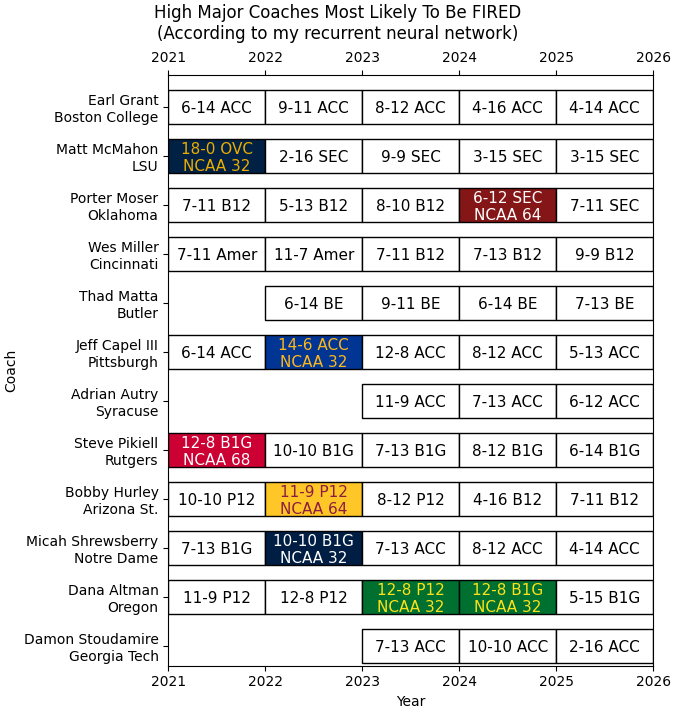
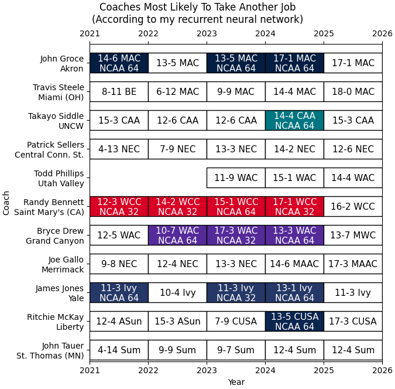

# ncaabball

College basketball analysis with a focus on the NET, WAB, and making cool graphs.

(Updated weekly-ish or upon request.)

## NET Estimates 2026

### Introduction

The NCAA Evaluation Tool (“NET”) is a computer ranking of college basketball teams. Millions of fans are interested in the NET because it's used in choosing which teams are chosen to play for a national championship. While the exact formula is a secret, the NCAA has stated that it considers two factors: "Adjusted Net Efficiency" and "Team Value Index". I can calculate both factors and estimate the NET ranking with good accuracy.

### FAQ

**Q: What code and data can calculate the NET?**

[Python code to estimate NET](/Estimate_NET.py) (Updated Fall 2025)\
Input: [2026 game results](/ncaab_stats_input_2026.csv)\
Output: [Estimated NET rankings](/estimated_net_output.csv)

**Q: How is the NET calculated?**

There are two components. Both are calculated with regression techniques.

The "Adjusted Net Efficiency" looks at the difference in the score per 100 possessions. (Possessions are estimated by the number of field goal attempts minus the number of offensive rebounds plus the number of turnovers plus 0.475 times the number of free throw attempts.) There is a **big** difference between winning by 50 and winning by 1. There is a **small** difference between winning by 1 and losing by 1. Winning by 6 points in 60 possessions is equal to winning by 8 points in 80 possessions.

The "Team Value Index" looks at which team won the game. It considers how all teams have won or lost against all other teams. This is comparable to a popular ranking method called a Bradley-Terry model. With this method, teams get a lot of credit for beating teams that beat other teams. This is not a shallow calculation of winning percentage like the RPI had. Every game affects all 360+ teams.

I count the Efficiency rating at 80% and the Value rating at 20%. For example, a team that is 10th in Efficiency and 25th in Value might have a NET ranking of about 13.

**Q: Why is (some team) ranked so high or low?**

The NET mostly makes sense by the end of the season. In November-December, there's a conflict where humans have preseason expectations and the NET does not. For example, imagine that only 2 games have been played and these are the results:

* Team 1 beat Team 2, 103-74.
* Team 3 beat Team 4, 93-87.

You would rank Team 1 the best, then Team 3, then Team 4, and last Team 2. Now see this:

* Team 1 (VCU) beat Team 2 (Wagner), 103-74.
* Team 3 (Arizona) beat Team 4 (Florida), 93-87.

And you think "Oh, Arizona and Florida are better than VCU and Wagner!" The NET doesn't do that. Every team starts the season as equals.

Also, due to buy games, there's a big adjustment for home court advantage early in the season. For example, imagine that only these 3 games have happened:

* Team A (home) beat Team B by 28.
* Team C (home) beat Team D by 10.
* Team E (home) beat Team F by 7.

You would probably rank these: Team A, Team C, Team E, Team F, Team D, Team B.

But wait a minute. The home teams won by an average of 15 points. It's only fair to adjust for a home court advantage. Maybe this makes more sense:

* Team A is (28 - 15) 13 points better than Team B.
* Team C is (10 - 15) 5 points WORSE than Team D.
* Team E is (7 - 15) 8 points WORSE than Team F.

So then they should be ranked: Team A, Team F, Team D, Team C, Team E, Team B.

This effect will be lower by March when all teams have played dozens of others in various locations.

**Q: What can my team do to have a good NET ranking?**

1. Win. Win by a lot.
2. Don't lose. Don’t lose by a lot.
3. Avoid bad field goal attempts and turnovers. Play defense. Every possession counts!
4. Do well in non-conference games. If Michigan beats Oakland, Michigan gains credibility and Oakland loses credibility, and then there is more credibility in the Big Ten and less credibility in the Horizon League. But if Georgia Tech beats Syracuse and Syracuse beats Wake Forest and Wake Forest beats Georgia Tech, you can imagine that the credibility just recirculates around the ACC.
5. Schedule your earliest games against teams with mostly freshmen or transfers. If those opponents are weaker when you play them in November and stronger when they gel in January, you'll look good in comparison.
6. Play an away game in November, preferably at a school that you can blow out. (Like Missouri did at Howard.) This won't actually be very helpful in March, but you'll look good when the NET is released in December and that can shape your narrative in the national media.
7. Neutral wins are better than home wins, but not by much. Don't play in an empty arena for the NET's benefit. It barely matters.

**Q: Can a team manipulate the NET by scheduling bad teams and running up the score?**

Probably not. Well, if you can play like UConn beating UMass Lowell 110-47, sure, do that. But more often, beating bad teams will hurt more than it helps. There's three reasons:

First, 20% of the NET uses the Value metric. This doesn't use the score and beating a bottom-50 team at home is basically worthless.

Second, the other 80% of the NET, the Efficiency metric, does use the score, but it adjusts for pace. You can't just go fast and have a big point differential. Winning by 30 in 60 possessions is equal to winning by 40 in 80 possessions. (Every possession does count though, on offense and defense.)

Third, the Efficiency metric also adjusts for opponent quality. Consider Iowa State beating Mississippi Valley State 83-44 in the 2024-25 season. You probably think that's a dominating victory and it helped the Cyclones finish #9 in the NET. No, that was Iowa State's worst win of the whole season. Take a look at these comparisons:

* **Prairie View** beat Mississippi Valley State by **11.1** points per 100 possessions.
* **Kansas State** beat Mississippi Valley State by **28.6** points per 100 possessions.
* **Iowa State beat Mississippi Valley State by 53.2 points per 100 possessions.**
* **Texas Southern** beat Mississippi Valley State by **55.0** points per 100 possessions.
* **Tulsa** beat Mississippi Valley State by **62.9** points per 100 possessions.
* **North Texas** beat Mississippi Valley State by **69.1** points per 100 possessions.
* **Texas** beat Mississippi Valley State by **78.3** points per 100 possessions.
* **Jackson State** beat Mississippi Valley State by **78.8** points per 100 possessions.
* **LSU** beat Mississippi Valley State by **89.0** points per 100 possessions.
* **Missouri** beat Mississippi Valley State by **103.6** points per 100 possessions.

You wouldn't call Iowa State a top 10 team because it had a worse result than Texas Southern had. Iowa State finished #9 in the NET despite this game, not because of it.

**Q: Is the NET a good way to measure that a team deserves to be in the NCAA Tournament?**

The NET is 80% a strength metric and 20% a resume metric. Imagine a team that loses by 1 at Duke, loses by 1 at Houston, and loses by 1 at Kentucky. A strength metric would say "They're good because a team that is 1 possession away from beating tough teams on the road should be favored to beat anyone at a neutral site." A resume metric would say "They're bad because they went 0-3." Both are right, but a strength metric is best for predicting who wins the next game and a resume metric is best for judging results. I kind of hate how the NET combines these methods, but since it's 80% a strength metric, I can see the logic where the selection committee doesn't care if you **are** a top-30 NET team but they are impressed if you **beat** a top-30 NET team. (But in my opinion, all top-35 NET teams that didn't make the tournament were robbed.)

**Q: How accurate are these calculations?**

For the 2025-26 season:

* For the first NET release ([see image created November 30](NETprojection.png)): 47 of 365 teams had exactly the right rank, 174/365 were within 2 spots, and 271/365 were within 5 spots.
* After stat corrections: 39 of 365 teams had exactly the right rank, 176/365 were within 2 spots, and 281/365 were within 5 spots.

For the 2024-25 season (old formula):

* For the first NET release (games through December 1): 47 of 364 teams had exactly the right rank, 199/364 were within 2 spots, and 313/364 were within 5 spots.
* For Selection Sunday: 142 of 364 teams had exactly the right rank, 337/364 were within 2 spots, and 363/364 were within 5 spots. (Sorry to Army. I predicted #301, actual was #307.)

### NET Scatter Plots

Showing Strength (teams at the top win by a lot) and Resume (teams at the right have quality wins.)

More graphs are in the [netscatter](/netscatter) directory.

[Code to create plots](/Plot%20Efficiency%20Value.py)

---

## WAB Estimates 2026

### Introduction

Wins Above Bubble (“WAB”) is a measure of a college basketball team's performance. It is the number of wins that a team actually has, minus the number of wins that you would expect a bubble team to have if they played the same schedule. For example, if Clemson is 23-7 and you would expect the 45th-strongest team to be 20-10 with Clemson's schedule, Clemson's WAB would be 3.

WAB was invented by Seth Burn and made popular by Bart Torvik, who taught it to the NCAA. Every game has a value based on its difficulty. For example, a win against a good team would add 0.80 to your WAB and a loss would subtract 0.20. A win against a bubble team would add 0.50 to your WAB and a loss would subtract 0.50. A win against a bad team would add 0.01 to your WAB and a loss would subtract 0.99.

### FAQ

**Q: What code and data can calculate WAB?**

[Python code to estimate WAB](/Estimate_WAB.py) (Updated February 2026)\
Input: [2026 game results](/ncaab_stats_input_2026.csv)\
Input: [2026 NET rankings](/actual_net.txt)\
Output: [2026 Estimated WAB vs. Actual WAB](/estimated_wab_output_2026.csv)\
Output: [2026 WAB impact per game](/game_impact_wab_2026.txt)

**Q: How is WAB calculated?**

The first step is to calculate each team's offensive and defensive efficiencies. This is the number of points per 100 possessions that were scored and allowed, adjusted for the opponent's strength. The NCAA and Bart Torvik calculate efficiency differently. The NCAA counts every game equally. Bart Torvik gives less credit to older games and to blowout wins.

* An example elite team has offense=125 and defense=90
* An example top-30 team has offense=120 and defense=95
* An example bad team has offense=90 and defense=110

Use a "Pythagorean expectation" formula to make a strength value between 0 and 1.

* The elite team has a strength of 125^11.5 / (125^11.5 + 90^11.5) = 0.978
* The top-30 team has a strength of 120^11.5 / (120^11.5 + 95^11.5) = 0.936
* The bad team has a strength of 90^11.5 / (90^11.5 + 110^11.5) = 0.090

Then decide how to define the "bubble team". Bart Torvik averages the offensive and defensive efficiencies for the 44th, 45th, and 46th strongest teams. The NCAA claims to use the team ranked 45th in the NET, but I get a closer match to their official WAB numbers when I use the average efficiencies of the 40th-45th strongest teams. Either way, we'll use these numbers for the example calculations:

* The hypothetical bubble team has offense=116 and defense=96
* The hypothetical bubble team has a strength of 116^11.5 / (116^11.5 + 96^11.5) = 0.898

Then the NCAA assigns the team strengths in order of the NET rankings. For example, on Selection Sunday 2025, the top 3 pythag strengths were Duke (0.990), Houston (0.989), and Auburn (0.986). However, the top 3 NET rankings were #1 Duke, #2 Auburn, and #3 Houston. So #1 Duke kept its own strength of 0.990, #2 Auburn got the #2 strength (0.989, from Houston), and #3 Houston got the #3 strength (0.986, from Auburn). Bart Torvik's WAB doesn't use the NET.

Next, calculate each game's value using the opponent's strength versus the bubble team's strength. This function is called the "log5" formula and it has a long history in baseball analytics and other rating systems.

game_wab = (opponent_pythag \* (1 - bubble_pythag)) / (opponent_pythag \* (1 - bubble_pythag) + bubble_pythag \* (1 - opponent_pythag))

* Playing against the elite team:  (0.978 \* (1 - 0.898)) / (0.978 \* (1 - 0.898) + 0.898 \* (1 - 0.978)) = 0.835
* Playing against the top-30 team: (0.936 \* (1 - 0.898)) / (0.936 \* (1 - 0.898) + 0.898 \* (1 - 0.936)) = 0.624
* Playing against the bad team:    (0.090 \* (1 - 0.898)) / (0.090 \* (1 - 0.898) + 0.898 \* (1 - 0.090)) = 0.011

A team earns that value for a win and loses one minus that value for a loss. Sum every game's value for the team's season total WAB.

* A team adds 0.835 to its WAB for beating the elite team, or subtracts (1 - 0.835) = 0.165 for losing.
* A team adds 0.624 to its WAB for beating the top-30 team, or subtracts (1 - 0.624) = 0.376 for losing.
* A team adds 0.011 to its WAB for beating the bad team, or subtracts (1 - 0.011) = 0.989 for losing.

The above is correct for neutral site games. To account for home court advantage, give a 1.3% advantage to playing at home and a 1.3% disadvantage to playing away. The math looks like this:

* The elite team (home) has a strength of (125\*1.013)^11.5 / ((125\*1.013)^11.5 + (90\*0.987)^11.5) = 0.983
* The elite team (away) has a strength of (125\*0.987)^11.5 / ((125\*0.987)^11.5 + (90\*1.013)^11.5) = 0.970
* The top-30 team (home) has a strength of (120\*1.013)^11.5 / ((120\*1.013)^11.5 + (95\*0.987)^11.5) = 0.952
* The top-30 team (away) has a strength of (120\*0.987)^11.5 / ((120\*0.987)^11.5 + (95\*1.013)^11.5) = 0.916
* The bad team (home) has a strength of (90\*1.013)^11.5 / ((90\*1.013)^11.5 + (110\*0.987)^11.5) = 0.118
* The bad team (away) has a strength of (90\*0.987)^11.5 / ((90\*0.987)^11.5 + (110\*1.013)^11.5) = 0.069
* The hypothetical bubble team (home) has a strength of (116\*1.013)^11.5 / ((116\*1.013)^11.5 + (96\*0.987)^11.5) = 0.922
* The hypothetical bubble team (away) has a strength of (116\*0.987)^11.5 / ((116\*0.987)^11.5 + (96\*1.013)^11.5) = 0.867

Reminder: If you want to calculate the WAB for New Mexico, and New Mexico plays Boise State, use the values of Boise State vs. the hypothetical bubble team. Do not consider the strength of New Mexico. Imagine that the hypothetical bubble team is taking the place of New Mexico. Therefore, the hypothetical bubble team is expected to be stronger in home games (in Albuquerque) and weaker in away games (in Boise). And Boise State is expected to be weaker when it is away (in Albuquerque) and stronger at its home (in Boise).

* Playing at home against the elite team:  (0.970 \* (1 - 0.922)) / (0.970 \* (1 - 0.922) + 0.922 \* (1 - 0.970)) = 0.732
* Playing on the road against the elite team:  (0.983 \* (1 - 0.867)) / (0.983 \* (1 - 0.867) + 0.867 \* (1 - 0.983)) = 0.900
* Playing at home against the top-30 team: (0.916 \* (1 - 0.922)) / (0.916 \* (1 - 0.922) + 0.922 \* (1 - 0.916)) = 0.478
* Playing on the road against the top-30 team: (0.952 \* (1 - 0.867)) / (0.952 \* (1 - 0.867) + 0.867 \* (1 - 0.952)) = 0.752
* Playing at home against the bad team:    (0.069 \* (1 - 0.922)) / (0.069 \* (1 - 0.922) + 0.922 \* (1 - 0.069)) = 0.006
* Playing on the road against the bad team:    (0.118 \* (1 - 0.867)) / (0.118 \* (1 - 0.867) + 0.867 \* (1 - 0.118)) = 0.020

Again, to get a team's total WAB, add together all of their game values and subtract the number of losses. If you're still struggling with the concept, imagine some games that a bubble team would have a 40% chance of winning. For example, a home game against the #15 team, an away game against the #50 team, or a neutral game against the #33 team. The game value would be 0.6 for each such game.

* If a team plays 10 of these games and goes 10-0, its WAB would be 6. (0.6 \* 10)
* If a team plays 10 of these games and goes 0-10, its WAB would be -4. (-0.4 \* 10)
* If a team plays 10 of these games and goes 4-6, its WAB would be 0. (0.6 \* 4 - 0.4 \* 6)

Finally, note that the NCAA only considers division 1 opponents. For Bart Torvik, playing non-D1 teams have basically 0 reward for winning and a -1 penalty for losing.

**Q: How accurate are these calculations?**

For Selection Sunday 2025:
* I nailed the WAB for Houston at 10.66, for Creighton at 2.69, and for Butler at -6.40.
* All teams had an estimated WAB value to be accurate within 0.50.
* 341 of 364 were accurate within 0.25.
* The team that I overestimated the most was Coppin State (estimated -19.85, actual -20.16.)
* The teams that I underestimated the most were all 16 SEC teams, with the most being Auburn (estimated 12.57, actual 13.06.) I didn't underestimate any non-SEC teams by more than 0.15. (I think it's suspicious. Yes, I know the SEC had a good season but that's accounted for in the calculations.)

I'm only calculating the NCAA's version of the WAB. I can calculate Bart Torvik's WAB using his "Barthag" strength ratings, but I haven't tried to calculate those ratings from game data.

**Q: Is WAB a good way to measure that a team deserves to be in the NCAA Tournament?**

It's clearly doing something right. It's undeniable that the teams with the best results are at the top of the rankings. I love the idea to judge teams by their total wins vs. expected wins. Most people put too much focus on big games. For example, in 2023, Arizona State made a buzzer beating halfcourt shot to beat #7 Arizona on the road. Arizona State was one of the last teams in the tournament and wouldn't have made it without that win. Now imagine a scenario where Arizona State missed that shot, but it replaced losses against USC and Colorado with wins. Its WAB would be better in this scenario, but it would probably miss the tournament because it didn't have a signature win. How can going 1-2 against Arizona/USC/Colorado be better than going 2-1 against those same teams? I think the humans have it wrong and WAB has it right.

I do think that WAB could be better. It can fluctuate based on which teams are ranked 44-46 (or however the bubble team is defined) and how teams enter and exit that range. I don't like how about 50 teams have a positive value for WAB while only about 45 teams could get an at-large bid. That means there are about 5 teams that do **better** than the hypothetical bubble team but they don't get in the tournament. If those teams are on the wrong side of the bubble, they don't have "wins above" the bubble, now do they? I'd recommend averaging more teams and using teams closer to #40 than #45. Also, why does the "pythag" formula has an exponent of 11.5 and not another number? Why is the home court adjustment a multiplicative 1.3% and not something else? The answer is just that Bart Torvik did some backtests and thought the results looked good. (Some of the details bug me, but if it works, it works.)

I also don't like how the NCAA forces the team strength to be in order of the NET rankings. On Selection Sunday 2025, Houston was the 2nd-strongest team by efficiency and #3 in the NET. And Auburn was the 3rd-strongest team by efficiency and #2 in the NET. So if a team played Houston, it got credit for playing Auburn. And if a team played Auburn, it got credit for playing Houston. Does that make sense? It seems dumb. I mean, it's probably fine, and I can understand that the NCAA wanted to make sure that beating the #1 NET team is more valuable than beating the #2 NET team, or that beating the #50 NET team is more valuable than beating the #51 NET team. But I think it makes sense how Bart Torvik creates a resume metric (WAB) from a strength metric (Barthag). When the NCAA adds the NET (which is a combination of a strength metric and a resume metric), they're double counting the results. This basically means that you get rewarded for playing low power teams with good results and you get punished for playing high power teams with bad results. For example, if you played NET #35 UC San Diego, you got credit for playing the 35th-strongest team, Arkansas. And if you played NET #133 Syracuse, you got credit for playing the 133rd-strongest team, St. Thomas (MN).

**Q: What can my team do to have a good WAB value?**

It's the usual stuff. Have a decent schedule and win games. Take more risk, get more reward. As I described in the last section, it's good to play low power teams with good records, and it's bad to play talented teams with bad records. But I doubt you can predict that when you're making the schedule. Most of the time, the NET rankings closely match team strength anyway.

There are probably some opportunities to find value. Like, perhaps a home game against George Mason is worth 0.20 WAB. If you think you have a better than 80% chance of winning that game, that's positive value. Or perhaps playing Houston is worth 0.84 at home, 0.90 neutral, and 0.95 away, and you think your chances of beating Houston are 30% at home, 15% neutral, and 5% away. The expected value for that is (0.84 \* 30%) - (0.16 \* 70%) = 0.14 at home, (0.90 \* 15%) - (0.10 \* 85%) = 0.05 neutral, and (0.95 \* 5%) - (0.05 \* 95%) = 0.00 away. So your preference would be to play them at home.

It's probably bad to play teams ranked worse than #300. You get about 0.01 credit for a win and lose 0.99 credit for a loss. A team in the top 200 might be closer to 0.05 credit for a win. That may or may not be a big difference. But note that on Saturday morning before Selection Sunday 2025, when the committee was finalizing their last teams in, North Carolina had a WAB of 0.81 and West Virginia had a WAB of 0.80.

---

## Performance Charts

---

---

[Code to make performance charts](/Performance%20Charts.py)

See more graphs for coach performance by year hired: [all coaches](/performance_coachhired_full) or [without small conferences or interim coaches](/performance_coachhired_selected).

---

## NET & WAB Estimates 2025

[Python code to estimate NET](/2025/Estimate_NET_2025.py) (Old 2024-25 version)\
Input: [2025 game results](/2025/ncaab_stats_input_2025.csv)\
Output: [Estimated NET on Selection Sunday 2025](/2025/estimated_net_output.csv)
Bonus analysis: [2025 NET impact per game](/2025/game_impact_net_2025.txt)

[Python code to estimate WAB](/2025/Estimate_WAB_2025.py) (Old 2024-25 version)\
Input: [2025 game results](/2025/ncaab_stats_input_2025.csv)\
Input: [2025 NET rankings on Selection Sunday](/2025/actual_net_20250316.txt)\
Output: [2025 Estimated WAB vs. Actual WAB](/2025/estimated_wab_output_2025.csv)\
Output: [2025 WAB impact per game](/2025/game_impact_wab_2025.txt)

---

## NET Estimates 2024

[Code to estimate NET](/2024/Estimate_NET_2024.py)  (Old 2023-24 version)\
Input: [2024 game results](/2024/ncaab_stats_input_2024.csv)\
Output: [Estimated NET on Selection Sunday 2024](/2024/estimated_net_output.csv)

[Writeup](https://www.backingthepack.com/nc-state-basketball/2023/10/24/23928786/casting-a-wide-net-finding-the-basketball-rankings)

---

## NET Estimates 2023
[Code to estimate NET](/2023/Estimate_NET_2023.py): (Old 2022-23 version)
Input: [2023 game results](/2023/ncaab_stats_input_2023.csv)\
Output: [Estimated NET on Selection Sunday 2023](/2023/net_estimate_output_selection_sunday_2023.csv)

---

## Data Sources
* The NCAA
* [CollegeBasketballData.com](https://collegebasketballdata.com/)
* [KenPom](https://kenpom.com/cbbga26.txt)
* [Bart Torvik](https://barttorvik.com/2026_season.json)
* [sports-reference.com](https://www.sports-reference.com/cbb/)
* [Team Color Data](teamcolors.csv) (from various school websites)
* Logos are from [SportsLogos.net](https://www.sportslogos.net/) and are not provided here

## Contact
* bchare at gmail
* [Twitter](https://x.com/bchare) (personal account)
